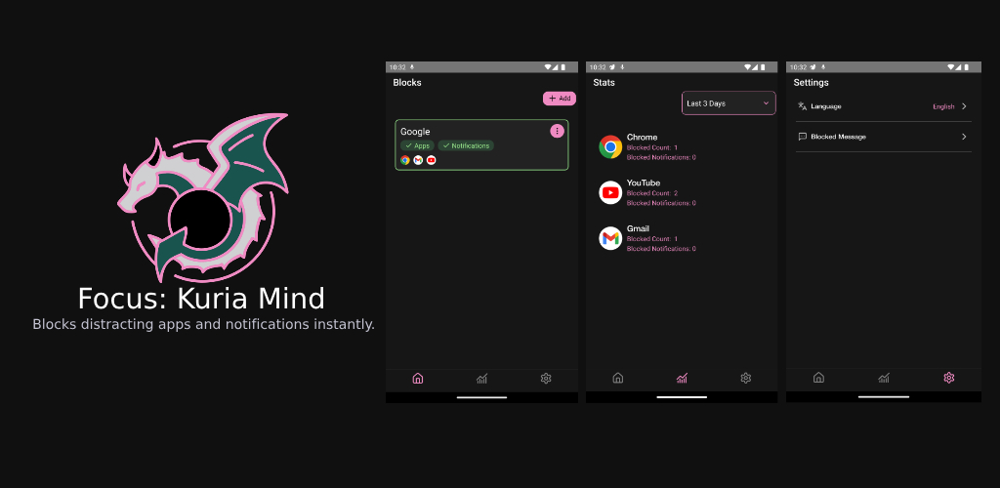

<div align="center">
    
</div>

# Kuria Mind

Kuria Mind is an Android application that allows users to manage app usage on their device. By creating blocks, users can select specific apps to restrict their execution and receive notifications about their activity.

&nbsp;


## 🚀 Features
- **Block Management:** Add applications to custom blocks to monitor and restrict their usage.
- **App Monitoring:** Implements native modules to detect app activity on the device.
- **Notification Blocking:** Restricts notifications from apps included in the blocks.

&nbsp;


## 🛠️ Technologies Used
- **React Native**
- **Gluestack**
- **Native Modules for App Monitoring**

&nbsp;


## Getting started

1. Install dependencies
```bash
yarn install
```

2. Start your application
```bash
yarn android
```
&nbsp;

## 📌 Project Status
Currently in development. Improvements are being made to monitoring features and performance optimization.

&nbsp;


Made with ❤️ using React Native.
